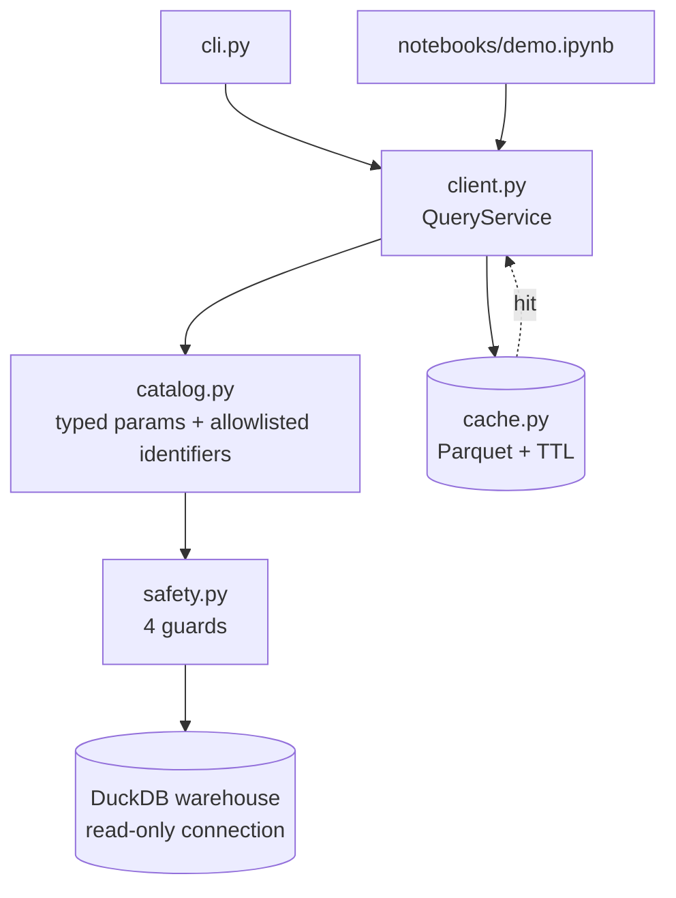

# Safe Query Service

> A parameterised, allowlisted query API over a DuckDB warehouse — four independent injection guards, a result cache keyed on everything that can change the answer, and the same object behind the CLI and the notebook.

[](https://github.com/Prithv122/query-service/actions/workflows/ci.yml)

**Live demo:** _not deployed — runs locally (see §6)_
**Stack:** Python 3.13 · DuckDB (TPC-H) · pandas · PyArrow · pytest · ruff · GitHub Actions

---

## 1. The problem

Analysts want to run the same handful of business questions with different dates, regions
and groupings, from a terminal and from a notebook, without waiting on the same scan twice
and without an engineer building a bespoke endpoint each time. The lazy version of this is
a function that string-formats user input into SQL — which is how a reporting tool becomes
the way someone drops a table. This is the careful version: named queries with typed
parameters, dynamic column names allowlisted per query, ad-hoc SQL allowed but guarded,
and results cached with an invalidation key that includes the warehouse itself.

## 2. The data

| | |
|---|---|
| Source | **TPC-H**, generated locally by DuckDB's `tpch` extension (`CALL dbgen`) |
| Size | Scale factor 0.1 — 600,572 line items · 150,000 orders · 15,000 customers · 8 tables |
| Licence | Data is generated on your machine; the TPC-H schema is a public benchmark specification. Nothing is redistributed in this repo |
| Refresh | `uv run query-service build --scale-factor 0.1` (needs network once, to fetch the extension) |

TPC-H rather than another invented dataset: the schema is one an interviewer already
knows, the joins are three deep and real, and there is no data file to license or host.
The row counts and timings below are from scale factor 0.1 on a laptop — they are
measurements of this machine, not benchmark claims.

## 3. Architecture



## 4. Key decisions & tradeoffs

| Decision | Chose | Over | Why |
|---|---|---|---|
| Statement validation | `duckdb.extract_statements` — ask the engine's own parser | Regex/keyword blocklist (`DROP`, `;`, `--`) | A blocklist has to keep up with comment syntax, string escapes, and every statement type DuckDB adds next. The parser already knows |
| Dynamic identifiers | Per-query allowlist declared in the SQL file's header, checked by set membership | Escaping/quoting user-supplied column names | A column name can't be a bound parameter, so this is the one place text reaches SQL. Membership in a closed set has no parser to outsmart |
| Defence in depth | Four independent layers (bind · allowlist · single-read parse · read-only connection + row cap) | One good check | Each layer assumes the ones above it failed. The read-only connection is what makes a bug in the other three survivable |
| Cache key | Hash of query name + **generated SQL** + bound values + row limit + warehouse fingerprint | Name + parameters | Caught by a test: the group-by dimension changes the SQL without changing a bound value, so a name+values key served the by-nation result for a by-region request |
| Cache invalidation | Warehouse file size + mtime in the key | Manual `--clear` | A rebuilt warehouse orphans every stale entry automatically. Silently serving yesterday's totals is the failure mode nobody notices |
| Ad-hoc SQL | Allowed, guarded, never cached | Blocked entirely | Analysts will always need an escape hatch; blocking it just moves the work outside the service. Its text is unbounded, so caching it would fill the disk with single-use entries |
| Query definition | `.sql` files with a JSON header | Python string constants | The SQL diffs, reviews and lints as SQL; parameters are declared next to the query that uses them |

## 5. Results

**Guards.** 59 tests. The adversarial suite runs 13 payloads that would work against a
string-concatenating service — stacked statements, `DROP`/`DELETE`/`COPY`/`ATTACH`/`INSTALL`,
`PRAGMA`, comment-terminated injections, and hostile identifiers such as
`n_name)) UNION ALL SELECT c_phone FROM customer --`. Every one is rejected by a *named*
guard before reaching the database, and a hostile *value* (`INDIA' OR '1'='1`) binds
harmlessly and returns 0 rows.

Two guards earned their place during the build rather than in the design:

- `PRAGMA database_list` parses as a `SELECT` in DuckDB and passed the parser guard. Added
  a first-keyword check on top of it — the parser is the strong check, the keyword is the
  cheap second opinion.
- The cache key originally omitted the allowlisted identifier, so a by-region request was
  served the by-nation result. Now the generated SQL is in the key.

**Cache** (scale factor 0.1, median of 5 runs, row limit 1,000):

| Query | Cold (ms) | Warm (ms) | Speedup | Rows |
|---|---|---|---|---|
| `revenue_by_dimension` | 54.5 | 2.9 | **18.7×** | 25 |
| `top_customers` | 94.8 | 4.3 | **22.1×** | 1,000 |
| `late_shipments` | 30.0 | 3.5 | 8.6× | 5 |
| `daily_order_volume` | 7.2 | 3.3 | 2.2× | 365 |

The last row is the honest one: `daily_order_volume` touches only `orders` and is already
fast, so the ~3 ms floor of reading a Parquet file back eats most of the win. A cache pays
for itself on the expensive joins, not on everything.

**Example output** (`revenue_by_dimension`, dimension `r_name`, calendar 1995):

| dimension | net_revenue | orders | avg_discount |
|---|---|---|---|
| AFRICA | 639,835,184.38 | 4,686 | 0.0495 |
| ASIA | 639,301,085.32 | 4,623 | 0.0500 |
| EUROPE | 634,777,681.19 | 4,621 | 0.0506 |
| MIDDLE EAST | 629,625,131.79 | 4,590 | 0.0499 |
| AMERICA | 600,704,573.04 | 4,389 | 0.0500 |

(TPC-H data is uniformly generated, so the regions being within 6% of each other is a
property of the generator, not a finding.)

## 6. How to run

```bash
git clone https://github.com/Prithv122/query-service.git
cd query-service
uv sync
uv run query-service build                 # TPC-H sf=0.1; fetches the DuckDB tpch extension once
uv run pytest                              # 59 tests (builds its own sf=0.01 warehouse)

uv run query-service list -v
uv run query-service describe top_customers
uv run query-service run revenue_by_dimension \
    --param start_date=1995-01-01 --param end_date=1996-01-01 --param dimension=r_name
uv run query-service run top_customers \
    --param region=EUROPE --param start_date=1995-01-01 --param end_date=1996-01-01 --limit 10
uv run query-service sql "SELECT count(*) AS n FROM lineitem"
uv run query-service cache                 # entries, bytes, ttl
```

Try to break it:

```bash
uv run query-service run revenue_by_dimension --param dimension="n_name; DROP TABLE customer" \
    --param start_date=1995-01-01 --param end_date=1996-01-01   # exit 2, Rejected:
uv run query-service sql "SELECT 1; DROP TABLE customer"                                # exit 2
```

The notebook interface is `notebooks/demo.ipynb` — same `QueryService` object, results
render with their provenance (rows, cache hit, milliseconds).

No accounts, no services, no env vars. Network is needed once, for the DuckDB extension.

## 7. What I'd change at 100× scale

At scale factor 10 (~60M line items) the shape still holds, but three things change:

1. **The cache becomes a shared service, not a directory.** A per-process `.cache/` is
   fine for one analyst; several need Redis (or object storage) keyed the same way, plus
   single-flight so ten people asking the same question cause one scan, not ten.
2. **The row cap stops being enough.** A capped result set does not cap the *scan*. I would
   add a query timeout, a scanned-bytes budget (`EXPLAIN ANALYZE` before serving), and
   per-user concurrency limits — the DoS vector here is an expensive legal query, not an
   injection.
3. **Warehouse-side guards.** The read-only connection would become a database role with
   `SELECT` grants only, so the guarantee lives in the server rather than in a Python
   keyword argument, and every query would carry a user tag for audit.

The catalog itself scales fine — it is text files — but past ~30 queries it wants
ownership metadata and freshness expectations attached, at which point it is a semantic
layer and belongs in dbt rather than here.

---

## References

None consulted. The four-layer structure is standard defence-in-depth; the specific choice
to validate statements with `duckdb.extract_statements` rather than a keyword blocklist
came from reading the DuckDB Python API reference for what it exposes.
